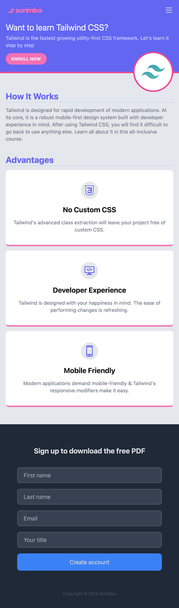

# Tailwind LP

A sample LP styled with Tailwind for the Scrimba Tailwind course. Used as a learning exercise to practice Tailwind classes.

## Resources

- [Course link](https://v2.scrimba.com/learn-tailwind-css-c010)

## Installation

- `npm install`
- `npm run dev` for local server or `npm run build`